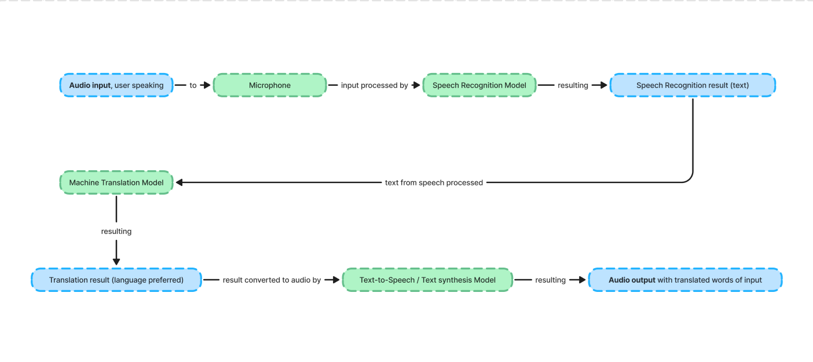

<h1 align="center"> AI Real-Time Audio Translation </h1>
<p align="center"> Main repository of AMD Pervasive AI Developer Contest @ Infinite Learning of AI Real-time Audio Translation teams. </p>

<div align="center">
    <!-- Your badges here -->
    
    
    
    
    
    
    
    
    
    
</div>

 

### Teams

- Arifian Saputra [(arifian853)](https://github.com/arifian853)
- Fariq Almasri [(Fariq211200)](https://github.com/Fariq211200)
- M. Ikhlasul Akbar [(PinoyBloon)](https://github.com/PinoyBloon)
- Fadliman Hagianto [(Fhagianto)](https://github.com/Fhagianto)

### Project flow
This is how the project will run, in a simple term :

 


### Virtual Environment Requirements

- Download Python v3.10.11 in https://www.python.org/downloads/release/python-31011/
- Activate your virtual environment with the name ```venv10``` : 
```
C:\Users\your_users\AppData\Local\Programs\Python\Python310\python.exe -m venv venv10
```
- These are requirements for the backend project : 
```
openai-whisper
TTS
flask
flask_cors
torch
librosa
transformers
pydub
sentencepiece
sacremoses
```
- Install the dependency requirements in the ```requirements.txt``` file with : 
```
pip install -r requirements.txt
```
- Activate the virtual environment it with : 

```
./venv10/Scripts/activate
```

### Backend Requirements


- Run the server :

```
py server.py
```
- Backend will served in ```localhost:5000```, and will only serve ```/transcribe``` endpoint.
```
http://localhost:5000/transcribe
```


### Frontend Requirements

- Install the dependency : 
```
npm install
```
- Run the app
```
npm run dev
```
- The app will run at : 
```
http://localhost:5173
```

### Model used in backend

- OpenAI Whisper as Automatic Speech Recognition Pre-trained Model
- MarianMT as Machine Translation Pre-trained Model
- tacotron2-DDC as Text to Speech Pre-trained Model
- hifigan as vocoder Model